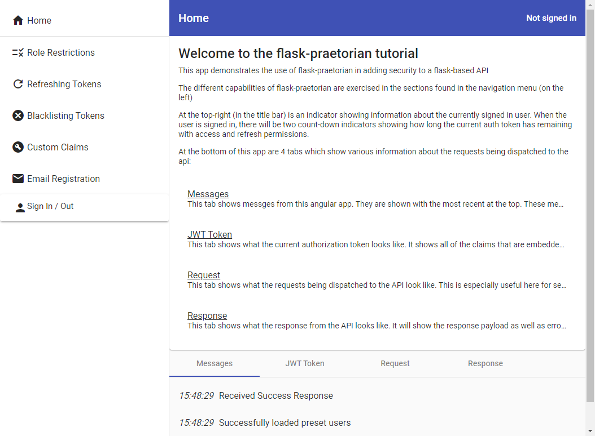
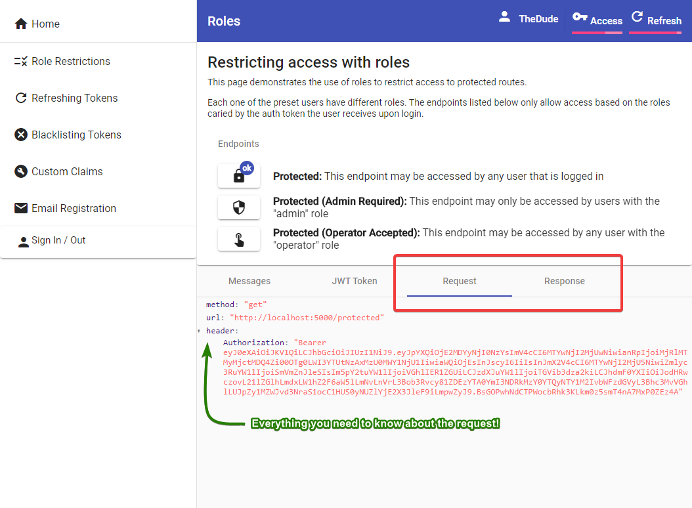

# Setting up the tutorial webapp

In order to demonstrate the features of flask-praetorian, this tutorial provides an
angular webapp that interacts with a minimalistic flask API.




## Requirements

In order to run the tutorial app, you will need docker and docker-compose


## About the tutorial-webapp

You are welcome to poke around the implementation of the tutorial webapp, but it's
written to look nice and be responsive, not to demonstrate minimal compatibility with
flask-pretorian API extension. So, don't be distracted by this source code or its
complexity. Using flask-praetorian is actually pretty simple.

The main thing to focus on as you go through the tutorial is the structure of the
requests and responses. These can be explored in the "Request" and "Response" tab along
the bottom of the tutorial webapp.



If you do not wish to use the tutorial webapp for this tutorial, you could use a
tool designed for sending requests to an API such as Postman or curl. In either
case, the requests described in the 'request' box in the screenshots of this tutorial
can be used with the tool of your choice.

The source code for both the flask API app and the angular webapp  are located in the
`ui` and `api` directories of the tutorial source code.

## Getting the code

First, you will need to clone the tutorial git repostiory. It can be found on
[https://github.com/dusktreader/flask-praetorian-tutorial/](github).

Clone this anywhere you please and then navigate your new flask-praetorian-tutorial
directory

## Starting up the apps

It's pretty simple to get things going as long as you have docker-compose. Simply
run:

```bash
docker-compose up --build
```

## Accessing the tutorial webapp

Once docker-compse is finished firing up the apps, you can check out the
[http://localhost:4200](tutorial webapp) in a browser
